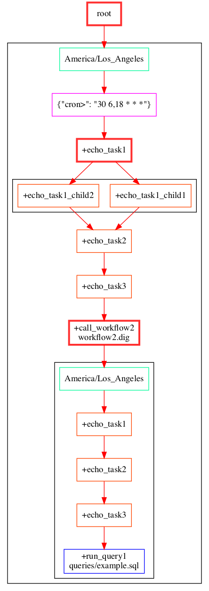

# `Treasure data digdag visualization`

Treasure data is a leading CDP platform and leverages dig-dag for data pipelines within itself. digdag is similar to airflow where we define tasks inside a dag 
and is available as an open source. The CDp is a powerful platform but unfortunately no easy way to visualize the pipelines which makes it hard for onboarding 
when there are some complex pipelines already built. So I had the below sequence of steps to solve this problem for myself.

## Solution Approach
- Create Visualization
- Make it colorful
- Update the graph everytime there is a code change.
- Make it part of CICD




## Installation

```sh
pip install -r requirements.txt
```

## Usage example
- Update Line 131 with the project where the graphs need to be updated.
- Execute the python program to generate the graphs.


#### TODO
- Parametrize the dir_name (Line 131) 
- Create github workflow to generate graphs when there are changes.
    - Identify the changes at the folder level 
    - Execute the python script tp build graph for each folder with a change
    - Commit the graphs back to the branch
    

### References
- https://github.com/y-abe/digdag-graph

